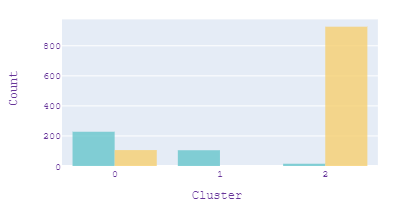
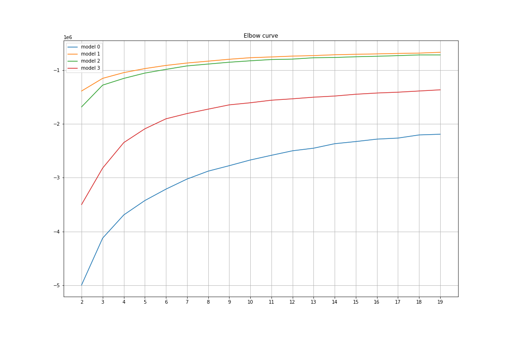
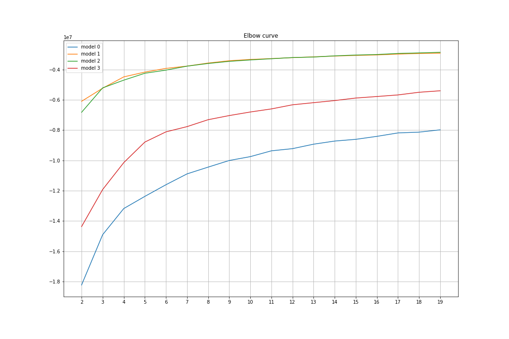
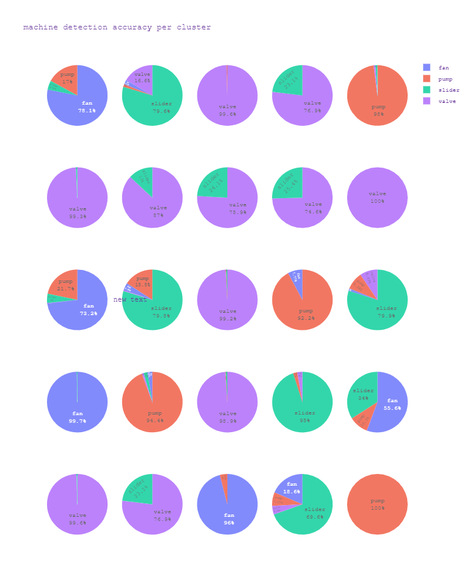
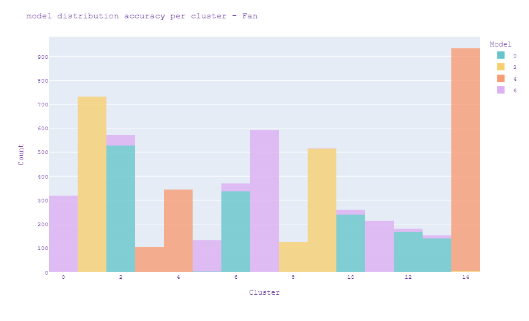
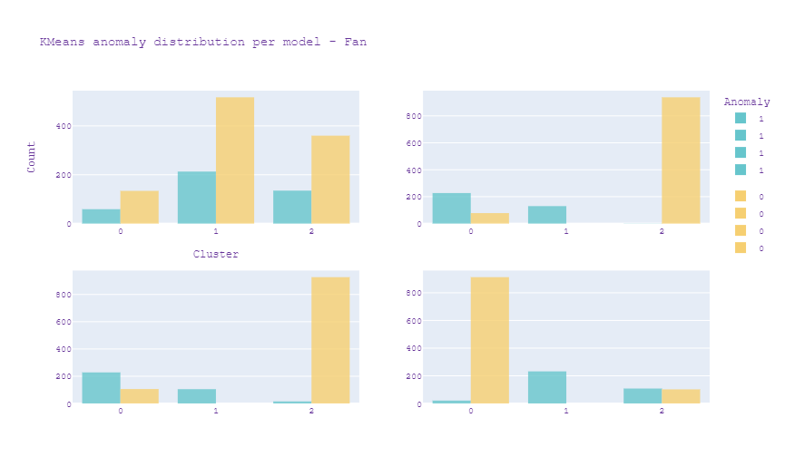
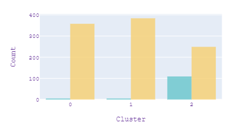
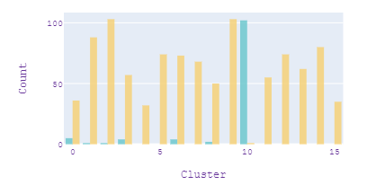
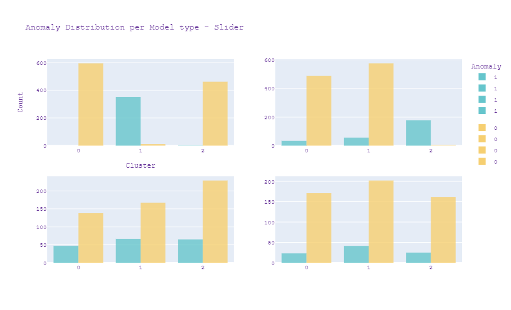
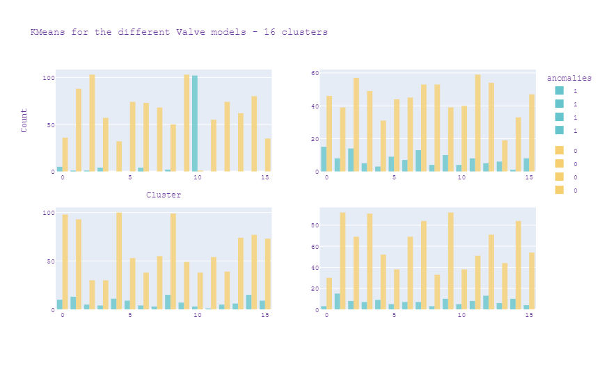

# AudioMalfunctionDetection
Project for detecting machine malfunction from audio files.

## Exploring the Data

The data consists of 10 second sound samples that recorded normal or abnormal features of 
machines during production. There are four types of machines : valves, pumps, fans and slide rails.
Each machine has samples of 4 different models of the same type.

The normal to abnormal ration per machine type looks like this:

### Channel optimization

The device the client will be using for the signal detection are the TAMAGO-03 microphones from
*System In Frontier Inc.*, which uses an array of 8 microphones to detect sounds from all angels.

 Each microphone is directed towards a machine, and picks that signal up louder than the others,
 represented here.
 
 
 
 When the accuracy is plotted against each channel it gives us these results.

Our ideal pipeline would be to split the channel, and use the optimal channel for each machine.
This would reduce the *bleeding* of unwanted sounds into our signal
For each machine a seperate detection is made optimizing the results.

### PreProcessing

Each signal is converted into it's mel spectrograms that look like these:

The precise parameters of this generation are optimized for each machine_type,
using a train and validation dataset split.

### Model Types

For each machine type there are several different models, the accuracy per model deviates and is not
the same shown in the following graph:

From this we can conclude that for some models we can predict failure close to perfectly and for some others
the prediction is less otimal.

### Valves

Due to their placement in the factory the valves are of significant importance. Any failure of a valve
can cause malfunction in the pumps, which are far harder to repair or replace. As such we placed
special importance on detecting failure in them.

In contrast to pump, fan and slide rails that have a continouous sound recording the valves open and
close at different intervals.

We noticed that a portion of the malfunctions happen because of irregularities in the time intervals between these operations. 

Calculating the average of these time intervals per sound sample gave a realistic range of normal functioning.

applying a threshold over the averages automatically cuts the top of the abnormale group on th right.
This is a group of about 19% of all valve malfunctions that are detected with 100% precision almost immediately.

After this normal detections are used to complement accuracy of the other malfunctions.

## Unsupervised Learning

The next part of the project focused on applying unsupervised learning to the data.
Because of the nature of unsupervised learning, training algorithms will give a number of clusters.
It is our mission to interpret the meaning of these clusters and inverstigate whether they represent
useful information.

### Metrics

Because the data is already labeled we can use the labelling to interpret the clusters. Specifically the need 
has been expressed to find a distinction between *normal* and *abnormal* functioning of the machines, as well as
a *transitory* state in which the machines should have maintenance in stead of repair.

We concluded that finding this distribution would allow us to tackle the detection.

Where there are 3 clusters:
- 1 containing almost all normal samples, 
- 1 containing almost all abnormal samples,
- 1 containg a smaller sample of both, describing a transitory phase where inspection is required.

Rather than use scoring metrics, as was done in a previous report when working with Supervised Learning, in these cases
the risk of overfitting is not present and the accuracy score combined with the graph distribution as above had 
the preference.

Furthermore, on each model the elbow method was used to calculate both optimal number of clusters and which feature
to use. In the examples below we can see the difference between using *mel spectrograms* and *mel frequency cepstral
coëfficient*

spectrogram         |  mfcc
:-------------------------:|:-------------------------:
 | 

For each algorithm the optimal types were selected, by finding the best *bend* of the curve as it represents the most 
significantly distinct clusters.

### Initial exploration

To determine the best approach, the first step was to run through all the data and see what the clustering gave.
When grouping into what was calculated as the optimal amount of clusters, and plotting this against the prevalence
of anomalies the results were poor.

When plotting the same clusters to the machine types, better results were found:

Not perfect but the clusters do seem to largely group by machine type. From this was concluded to continue working
with each machine subset seperately. 

Starting with the Fan machines this was the result:

Because each bar has an almost equal distribution between normal and abnormal samples again this turned out to be useless.
When plotting the same clusters to the model types however the results were much better:

This shows an almost perfect distribution of 1 model per bar. From this followed the conclusion that clustering should happen 
for each model seperately. When applying the clustering on each model the result looked like this:

Where the first graph still seems to give a meaningless grouping, the last 3 are almost perfect representations of the result 
we were looking for, as described above. If you look at the Model Types section, you can see this corresponds to the results 
found there.

At times the distinction between the different clusters could be improved by working with more clusters.

In the first graph no division can be made between transitory state, normal and abnormal.
In the second graph we can see that cluster 10 holds almost only abnormal samples.
We can group the other clusters between a fully normal group and a group of both normal and abnormal.
When increasing the number of clusters, we can group the clusters together and get a meaningful result that way.

### Choice of model

For all machines and model types an optimization was run for both feature type and model type.
For the valves the most meaningful model was the Gaussian Mixture Model, possibly due to it's suitability to work
with a large set of features. For all others the KMeans algorithms gave the best result.

### Results

The following results were achieved for all machine types:

 
|  Fan       | Model 1  | Model 2  | Model 3  | Model 4  |
| ---------- | -------- | -------- | -------- | -------- | 
| Normal     | 67%      | 100%     | 100%     | 100%     |
| Abnormal   | 73%      | 100%     | 99%      | 100%     |
| transitory | 71%      | 75%      | 71%      | 58%      |
 

 

 

 
|  Slider    | Model 1  | Model 2  | Model 3  | Model 4  |
| ---------- | -------- | -------- | -------- | -------- | 
| Normal     | 100%     | 98%      | 75%      | 88%      |
| Abnormal   | 97%      | 99%      | 78%      | 86%      |
| transitory | 99%      | 94%      | 71%      | 84%      |
 

 

 

 
|  Pump      | Model 1  | Model 2  | Model 3  | Model 4  |
| ---------- | -------- | -------- | -------- | -------- | 
| Normal     | 100%     | 92%      | 100%     | 100%     |
| Abnormal   | 97%      | 100%     | 98%      | 95%      |
| transitory | 94%      | 95%      | 99%      | 92%      |
 

 

 

 
|  Valve     | Model 1  | Model 2  | Model 3  | Model 4  |
| ---------- | -------- | -------- | -------- | -------- | 
| Normal     | 99%      | 80%      | 90%      | 90%      |
| Abnormal   | 99%      | 10%      | 10%      | 10%      |
| transitory | 70%      | 85%      | 88%      | 90%      |
 

### Interpretation

In this case an optimal result would have amost perfect normal an abnormal scores and a 
Transitory phase between 50% and 95%. My conclusion is that allthough far from perfect for all the 
machines, using Unsupervised Learning for the model and machine types for which good results
are achieved detection can be almost perfect for both normal, abnormal and a transitory phase.
This should always be in combination with a large enough distribution of samples over the normal, 
abnormal and transitory groups, a threshold of 20% for the transitory phase would be ideal. 

Concretely this is valid for :
- model 2,3 and 4 of the valves 
- model 1 and 2 of the sliders
- No models of the pomps because of a bad distribution.
- None for the valves.

These results and models can be implemented in a tree like structure where detection for each machine and model
type will have it's own optimized detection and prediction. There is reason to be confident for a near perfect
detection for almost all of the equipment using a combination of supervised and unsupervised learning.

### Technical Details

This software makes extensive use of the following Python libraries: 

- sklearn
- plotly
- pandas
- numpy
- matplotlib
- os
- librosa
- ast
- tqdm

### Installation

- Clone the repository / download the files. Open your terminal and navigate to this directory.
- Install dependencies with `pip install -r requirements.txt`.
- Open the notebook of choice, and execute all the cells.
- Watch the magic happen!

