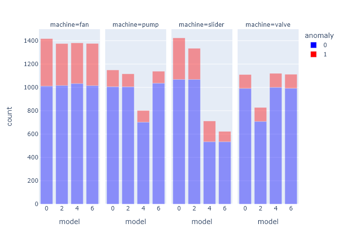
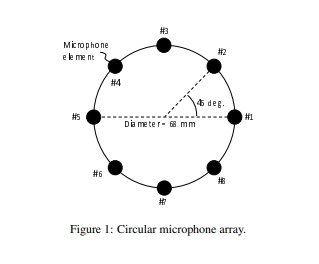
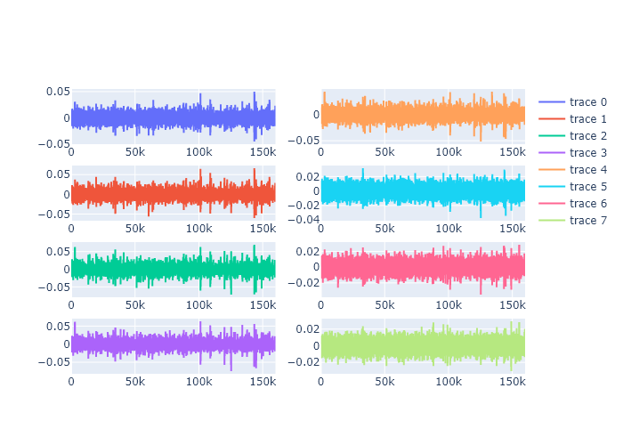
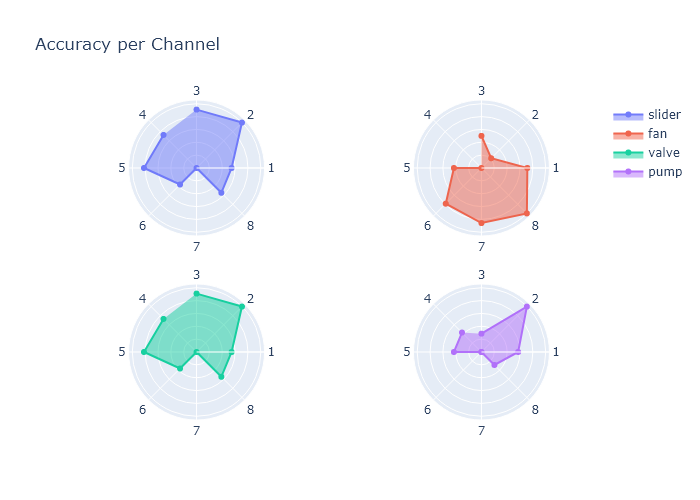
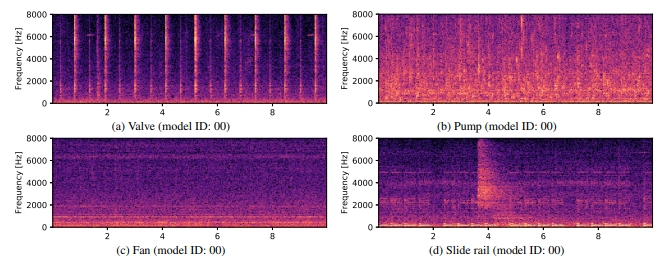
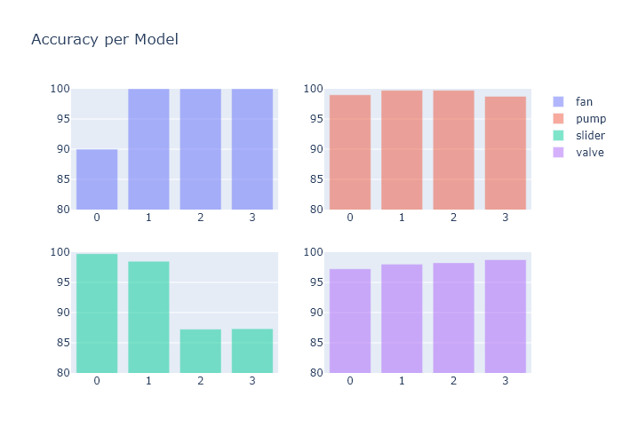
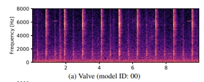
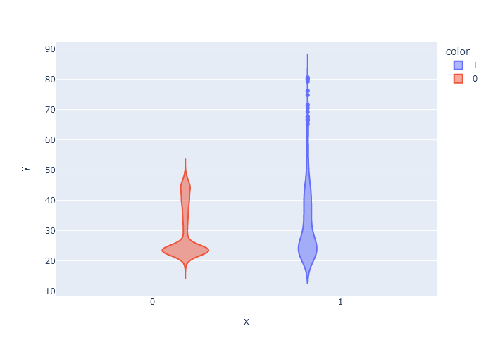
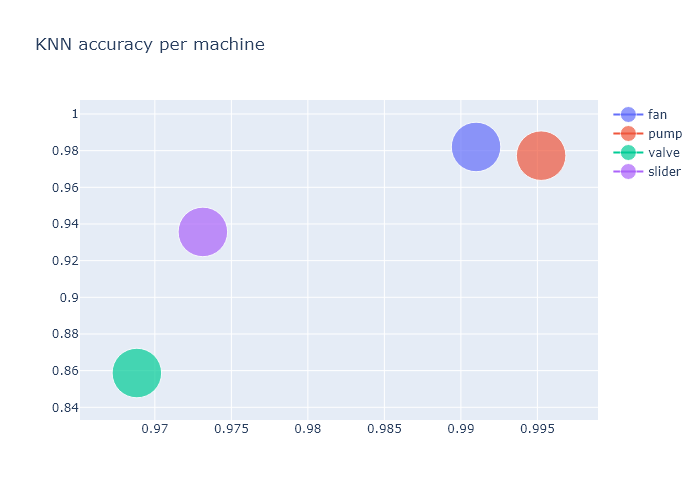

# AudioMalfunctionDetection
Project for detecting machine malfunction from audio files.

### Exploring the Data

The data comprises of 10 second sound samples that recorded normal or abnormal features of 
machines during production. There are four types of machines : valves, pumps, fans and slide rails.
Each machine has samples of 4 different models of the same type.

The normal to abnormal ration per machine type looks like this:

### Channel optimization

The device the client will be using for the signal detection are the TAMAGO-03 microphones from
*System In Frontier Inc.*, which uses an array of 8 microphones to detect sounds from all angels.

 Each microphone is directed towards a machine, and picks that signale up louder that the others,
 represented here.
 
 
 
 When the accuracy is plotted against each channel it gives us these results.

Our ideal pipeline would be to split the channel, and use the optimal channel for each machine.
For each machine a seperate detection is made optimizing the results.

### PreProcessing

Each signal is converted into unique mel spectrograms that look like these:

The precise parameters of this generation are optimized for each machine_type,
using a train and validation dataset split.

### Model Types

For each machine type there are several different models, the accuracy per model deviates and is not
the same shown in the following graph:

From this we can conclude that for some models we can predict failure close to perfectly and for some others
the prediction is less otimal.

### Valves

Due to their placement in the factory the valves are of significant importance. Any failure of a valve
can cause malfunction in the pumps, which are far harder to repair or replace. As such we placed
special importance on detecting failure in them.

In contrast to pump, fan and slide rails that have a continouous sound recording the valves open and
close at different intervals.

We noticed that a portion of the malfunctions happen because of irregularities in the time intervals between these operations. 

Calculating the average of these time intervals per sound sample gave a realistic range of normal functioning.

applying a threshold over the averages automatically cuts the top of the abnormale group on th right.
This is a group of about 9% of all valve malfunctions that are detected with 100% precision almost immediately.

After this normal detections are used to complement accuracy of the other malfunctions.

### Models

Two types of models have been trained for the detection, KNN algorithms and One class SVMs. 
Both of these models have been trained and tested on the full dataset and have been 
cross-validated to avoid overfitting.

Details of the performance of KNN:

This project used librosa <a href="https://doi.org/10.5281/zenodo.591533" rel=nofollow>

McFee, Brian, Colin Raffel, Dawen Liang, Daniel PW Ellis, Matt McVicar, Eric Battenberg, and Oriol Nieto. "librosa: Audio and music signal analysis in python." In Proceedings of the 14th python in science conference, pp. 18-25. 2015.

