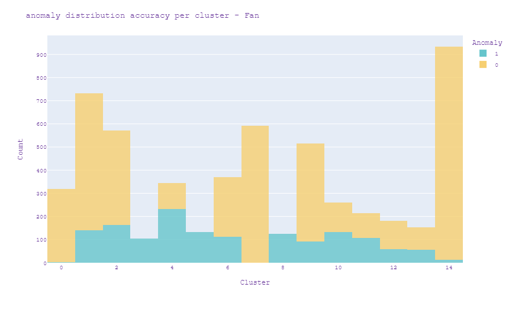

# AudioMalfunctionDetection
Project for detecting machine malfunction from audio files.

## Exploring the Data

The data comprises of 10 second sound samples that recorded normal or abnormal features of 
machines during production. There are four types of machines : valves, pumps, fans and slide rails.
Each machine has samples of 4 different models of the same type.

The normal to abnormal ration per machine type looks like this:

### Channel optimization

The device the client will be using for the signal detection are the TAMAGO-03 microphones from
*System In Frontier Inc.*, which uses an array of 8 microphones to detect sounds from all angels.

 Each microphone is directed towards a machine, and picks that signale up louder that the others,
 represented here.
 
 
 
 When the accuracy is plotted against each channel it gives us these results.

Our ideal pipeline would be to split the channel, and use the optimal channel for each machine.
For each machine a seperate detection is made optimizing the results.

### PreProcessing

Each signal is converted into unique mel spectrograms that look like these:

The precise parameters of this generation are optimized for each machine_type,
using a train and validation dataset split.

### Model Types

For each machine type there are several different models, the accuracy per model deviates and is not
the same shown in the following graph:

From this we can conclude that for some models we can predict failure close to perfectly and for some others
the prediction is less otimal.

### Valves

Due to their placement in the factory the valves are of significant importance. Any failure of a valve
can cause malfunction in the pumps, which are far harder to repair or replace. As such we placed
special importance on detecting failure in them.

In contrast to pump, fan and slide rails that have a continouous sound recording the valves open and
close at different intervals.

We noticed that a portion of the malfunctions happen because of irregularities in the time intervals between these operations. 

Calculating the average of these time intervals per sound sample gave a realistic range of normal functioning.

applying a threshold over the averages automatically cuts the top of the abnormale group on th right.
This is a group of about 9% of all valve malfunctions that are detected with 100% precision almost immediately.

After this normal detections are used to complement accuracy of the other malfunctions.

## Unsupervised Learning

The next part of the project focused on applying unsupervised learning to the data.
Because of the nature of unsupervised learning, training algorithms will give a number of clusters.
It is our mission to interpret the meaning of these clusters and inverstigate whether they answer the
concrete needs of the clients.

### Metrics

Because the data is already labeled we can use the labelling to interpret the clusters. Specifically the need 
has been expressed to find a distinction between *normal* and *abnormal* functioning of the machines, as well as
a *transitory* state in which the machines should have maintenance in stead of repair.

For this the ideal cluster would look like this.

Where there are 3 clusters, 1 containing almost all normal samples, one containing almost all abnormal samples
and on containg a smaller sample of both, describing a transitory phase.

Furthermore, on each model the elbow method was used to calculate both optimal number of clusters and which feature
to use. In the examples below we can see the difference between using *mel spectrograms* and *mel frequency cepstral
coëfficient*

For each algorithm the optimal types were selected, by finding the best *bend* opf the curve as it represents the most 
significantly distinct clusters.

### Initial exploration

To determine the best approach, the first step was to run through all the data and see what the clustering gave.
When grouping into what was calculated as the optimal amount of clusters, and plotting this against the prevalence
of anomalies the results were poor.

When plotting the same clusters to the machine types, better results were found:

Not perfect but the clusters do seem to largely group by machine type. From this was concluded to continue working
with each machine subset seperately. 

Starting with the Fan machines this was the result:

Because each bar has an almost equal distribution between normal and abnormal samples again this turned out to be useless.
When plotting the same clusters to the model types however the results were much better:

This shows an almost perfect distribution of 1 model per bar. From this followed the conclusion that clustering should happen 
for each model seperately. When applying the clustering on each model the result looked like this:

Where the first graph still seems to give a meaningless grouping, the last 3 are almost perfect representations of the result 
we were looking for, as described above. If you look at the Model Types section, you can see this corresponds to the results 
found there.

